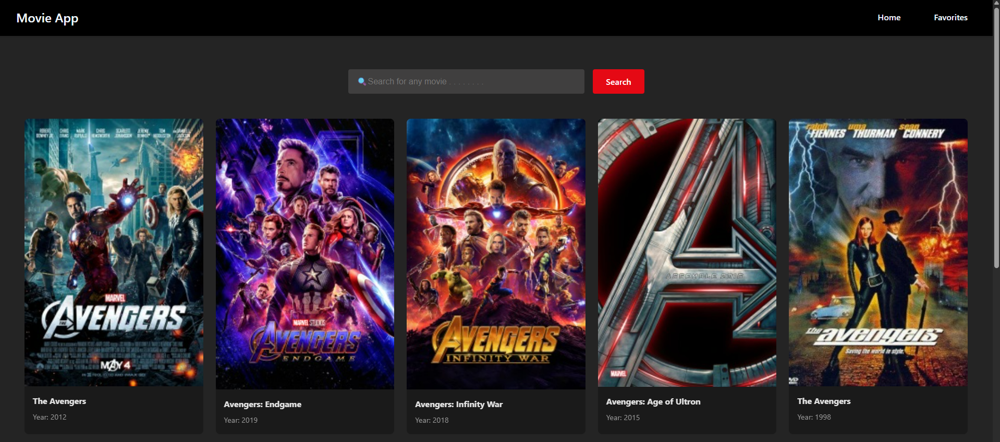
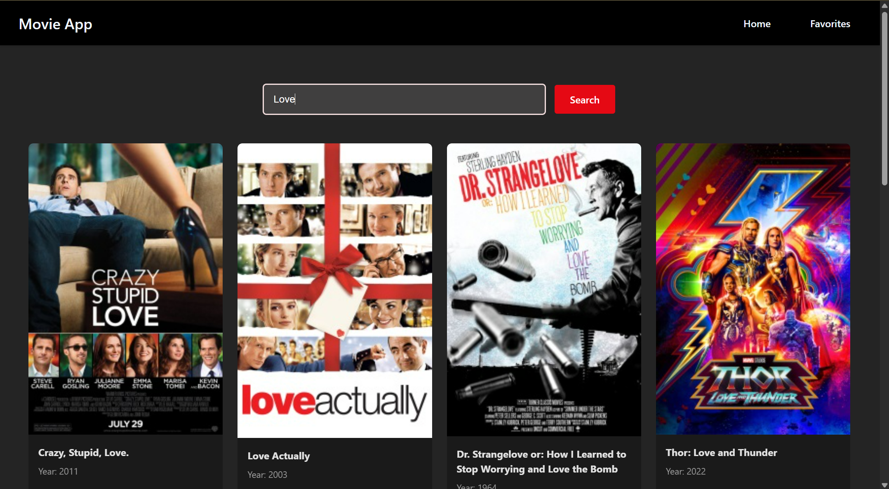
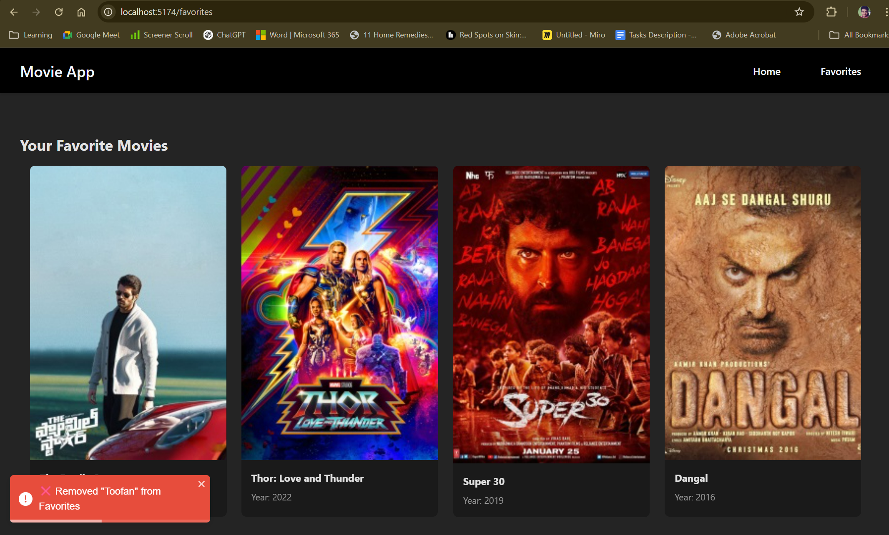

# 🎬 React Movie App

A movie search and favorite app built using **React** and the **OMDb API**.

## 🔍 Features

- Search for movies by title
- Add/remove movies from favorites
- Responsive UI with pagination
- Toast notifications on actions
- Data is fetched from OMDb API

## 🚀 Getting Started

```bash
git clone https://github.com/ShivakumarU/React-Projects-FrontEnd.git
cd <repo-name>
npm install
npm run dev


## 📸 Screenshots

### 🏠 Home Page


### 🔍 Search Result


### ❤️ Favorites Page


